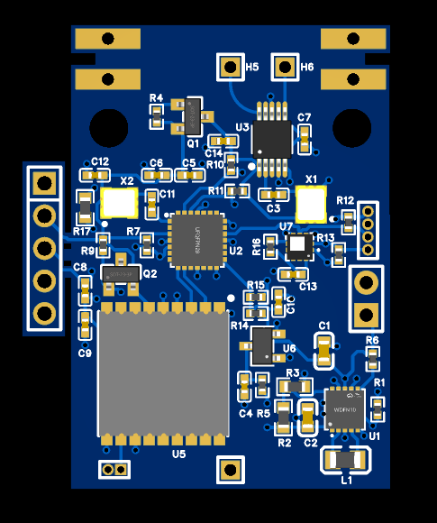
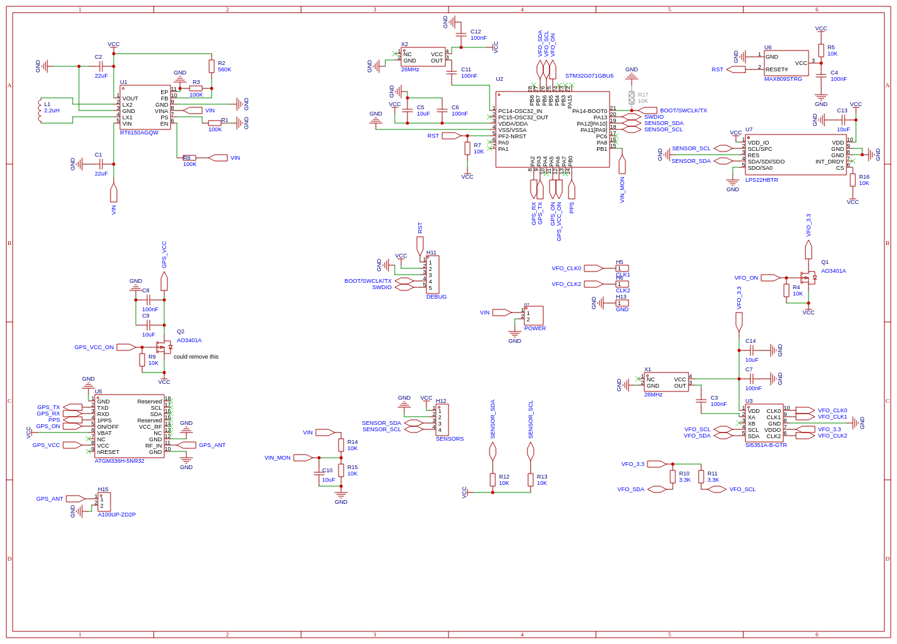

# Picoballoon Tracker

A WSPR based picoballoon tracker based around the STM32G071GB.

## Hardware Overview

- **Microcontroller**: STM32G071GB
- **GPS Module**: ATGM336H
- **Radio Frequency**: Si5351 clock generator with TCXO for WSPR transmission
- **Sensors**: 
  - LPS22 pressure/temperature sensor (I2C)
  - Internal temperature sensor
  - Battery voltage monitoring
- **Power Management**: RT6150B buck boost converter (1.8-5v to 3.3v output)

### Key Features

- **WSPR Telemetry**: Transmits position, altitude, temperature, and battery status
- **Multiple Transmission Types**: 
  - Type 1: Standard WSPR with callsign and grid square
  - Basic: Telemetry with altitude, temperature, voltage, speed
  - Extended: Additional pressure and satellite count data

## Hardware Design

### 3D Visualization


### Schematic


### Changes

 - 100uF cap added to VCC near each mosfet
 - 4 100uF caps added to VIN

 ### Weight
When using a 4 cell panel configuration, it's possible to get the weight down to less than 10g, including antennas etc.

### Pin Configuration

#### GPS Interface
- **GPS_SERIAL_TX**: PA2 (LPUART1 TX to GPS RX)
- **GPS_SERIAL_RX**: PA3 (LPUART1 RX from GPS TX)  
- **GPS_VCC_ON**: PA6 (GPS power control)
- **GPS_ON**: PA5 (GPS enable control)
- **GPS_PPS_PIN**: PB0_ALT1 (Pulse Per Second input)

#### Radio Interface (Si5351)
- **VFO_SDA**: PB7 (I2C data)
- **VFO_SCL**: PB6 (I2C clock)
- **VFO_VCC_ON**: PB5 (Si5351 power control)

#### Sensors
- **Pressure Sensor**: PA12 (SDA), PA11 (SCL) - LPS22 on dedicated I2C bus
- **Voltage Monitor**: PB1 (ADC input with 2:1 voltage divider)

#### Debug Interface
- **PC_SERIAL_TX**: PA14 (Debug UART TX)
- **PC_SERIAL_RX**: PA15 (Debug UART RX)

## Software Architecture

The firmware is built using PlatformIO with the STM32 Arduino framework and includes:

### Transmission Schedule

The tracker uses the traquito channel map and telemetry framework:

- **Type 1 WSPR**: Every 10 minutes at minute 0 (e.g., 12:00, 12:10, 12:20)
- **Basic Telemetry**: Every 10 minutes at minute 2 (e.g., 12:02, 12:12, 12:22)  
- **Extended Telemetry**: Every 10 minutes at minute 4 (e.g., 12:04, 12:14, 12:24)

### Configuration

Key parameters are defined in [`config.h`](src/config.h):

```cpp
#define CALLSIGN "M7GAQ"          // Amateur radio callsign
#define BAND "10m"                // WSPR frequency band  
#define CHANNEL 226               // Specific WSPR channel
#define THRESHOLD_VOLTAGE 2.2     // Minimum startup voltage
```

The threshold voltage is used to enure there is enough power to the solar panels before trying to start up, as this can cause brownouts. If you draw too much current from solar cells, the voltage drops. 2.2v was found to work well for 4 0.5v solar cells.

## Building and Programming

### Prerequisites

- [PlatformIO](https://platformio.org/) installed
- Black Magic Probe or compatible SWD debugger

### Build Commands

```bash
# Build the project
pio run

# Upload to target (requires Black Magic Probe)
pio run --target upload

# Open serial monitor
pio device monitor --port /dev/ttyBmpTty --baud 115200

# Debug (requires Black Magic Probe)
pio debug
```

### Hardware Requirements

- **Debugger**: Black Magic Probe connected to SWD interface
- **Antenna**: 10m band antenna for WSPR transmission
- **GPS Antenna**: Dipole

## Power Consumption

I went with the STM32G071 in the hope to optimise power consumption. I'm yet to actually measure the power consumption as all the equipment I would use for this is at university.

## License

This project is licensed under the GNU General Public License v3.0. See [`COPYING`](COPYING) for full license text.

## Contributing

This is an open-source hardware and software project. Contributions are welcome for:

- Hardware design improvements
- Software optimizations  
- Power consumption reductions
- Additional sensor integration
- Documentation improvements

## Amateur Radio License

This device transmits on amateur radio frequencies and requires a valid amateur radio license to operate legally. Ensure compliance with local regulations and band plans.
